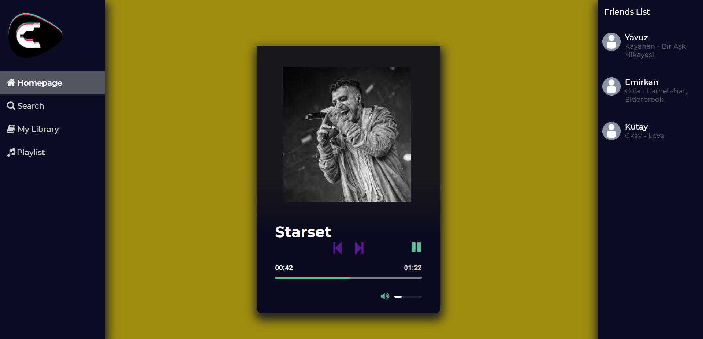
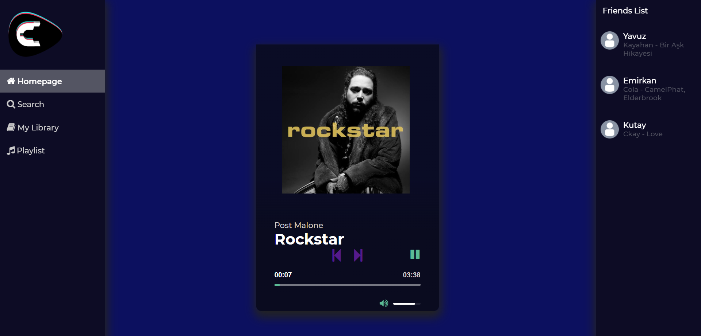

# Caltify Music Player

A music player built with django web framework
SE 383 Phyton Programming Project

## Dependencies
#### Python, Django==2.1, Pillow

## Run 

### `python manage.py makemigrations`
### `python manage.py migrate`
### `python manage.py runserver`

## Git

### Adding changes to stage `git add .`
### Commit `git commit -a -m  "[CODE-1] I do that. U do that"`
### Send choosen branch fe: master `git push origin master`

## Screenshots:

